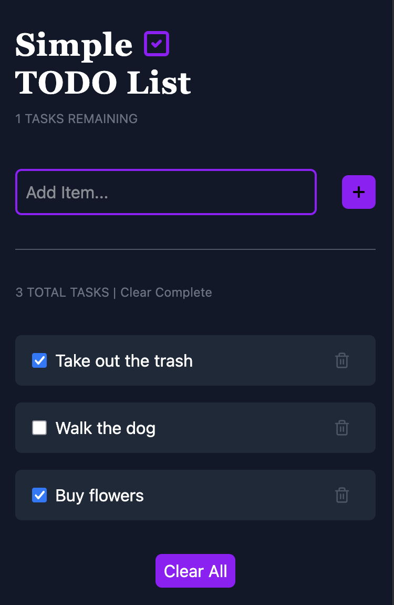

# Simple TODO List

A clean, minimal task manager built with React and TypeScript, featuring smooth GSAP animations and a dark UI styled with Tailwind CSS.

## Tech Stack

- **React** – Component-based UI with hooks (`useState`, `useEffect`, `useRef`)
- **TypeScript** – Fully typed components, props, and utility functions
- **Vite** – Fast dev server and build tooling
- **Tailwind CSS v4** – Utility-first styling with a dark theme
- **GSAP + SplitText** – Animated text and icon entrance on load
- **Lucide React** – Lightweight icon set

## Features

- Add tasks with input validation
- Mark tasks as complete via checkbox
- Delete individual tasks
- Clear all completed tasks at once
- Clear all tasks with a single button
- Persistent storage via `localStorage` — tasks survive page refreshes
- GSAP-powered heading animation on initial load

## Live Demo

[tavion-todo-list-app.netlify.app](https://tavion-todo-list-app.netlify.app)

## Screenshots


## Project Structure

```
src/
├── components/
│   ├── Header.tsx       # Animated heading + task count
│   ├── AddTask.tsx      # Controlled input form
│   ├── TodoList.tsx     # Task list, bulk actions
│   └── ListItem.tsx     # Individual task row
├── utils/
│   └── tasks.ts         # Pure functions for task state logic + Task interface
└── App.tsx              # Root component, state management
```

## Getting Started

```bash
# Install dependencies
npm install

# Run dev server
npm run dev

# Build for production
npm run build
```

